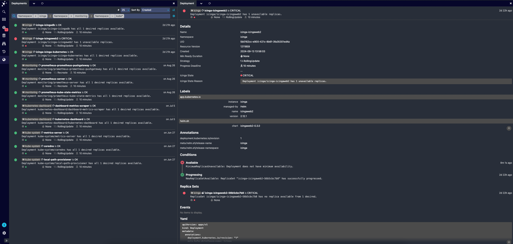
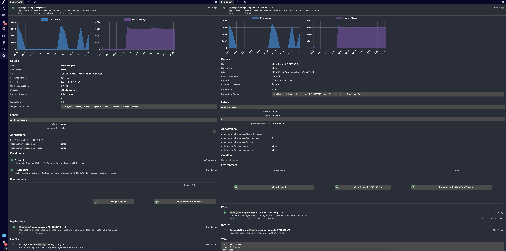

# Icinga for Kubernetes

Icinga for Kubernetes is a set of components for monitoring and visualizing Kubernetes resources,
consisting of

* the Icinga for Kubernetes daemon, which uses the Kubernetes API to monitor the configuration and
  status changes of Kubernetes resources synchronizing every change in a database, and
* [Icinga for Kubernetes Web](https://icinga.com/docs/icinga-kubernetes-web)
  which connects to the database for visualizing Kubernetes resources and their state.

Any of the Icinga for Kubernetes components can run either inside or outside Kubernetes clusters,
including the database.
At the moment it is only possible to monitor one Kubernetes cluster per Icinga for Kubernetes installation.

## Optional Features

### Metric Sync

Icinga for Kubernetes integrates with Prometheus to synchronize predefined metrics and display charts in the UI.
In future versions, we plan to incorporate these metrics into state evaluation and alerting.
To enable this feature you have to [configure a Prometheus server URL](03-Configuration.md#prometheus-configuration)
that collects metrics from your Kubernetes cluster.

## Installation

To install Icinga for Kubernetes see [Installation](02-Installation.md).

## License

Icinga for Kubernetes and the Icinga for Kubernetes documentation are licensed under the terms of the
GNU Affero General Public License Version 3.
