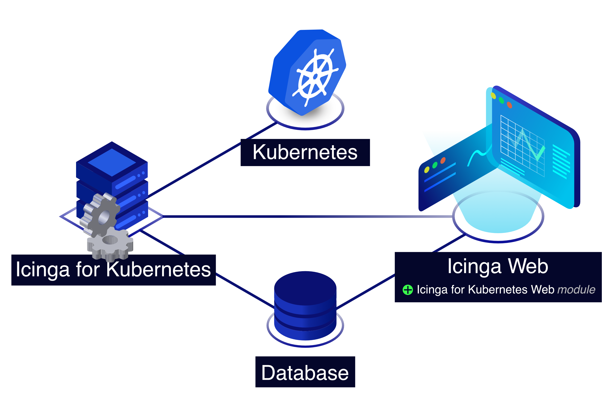

# Icinga Kubernetes

Icinga Kubernetes is a set of components for monitoring and visualizing Kubernetes resources,
consisting of

* the Icinga Kubernetes daemon, which uses the Kubernetes API to monitor the configuration and
  status changes of Kubernetes resources synchronizing every change in a database, and
* [Icinga Kubernetes Web](https://icinga.com/docs/icinga-kubernetes-web)
  which connects to the database for visualizing Kubernetes resources and their state.

Any of the Icinga Kubernetes components can run either inside or outside Kubernetes clusters,
including the database.
At the moment it is only possible to monitor one Kubernetes cluster per Icinga Kubernetes installation.

## Installation

To install Icinga Kubernetes see [Installation](02-Installation.md).

## License

Icinga Kubernetes and the Icinga Kubernetes documentation are licensed under the terms of the
GNU Affero General Public License Version 3.
