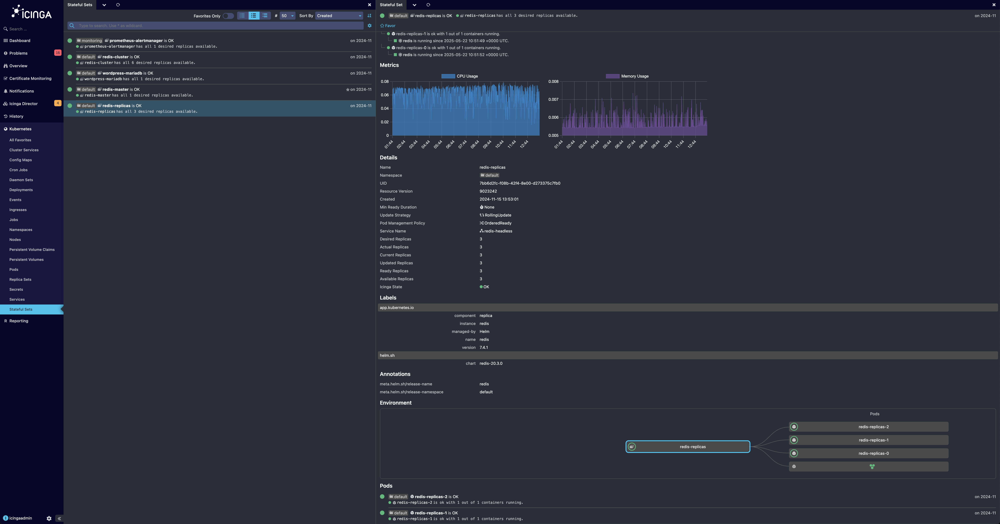

# Icinga for Kubernetes

Icinga for Kubernetes is a set of components for monitoring and visualizing Kubernetes resources,
consisting of

* the Icinga for Kubernetes daemon, which uses the Kubernetes API to monitor the configuration and
  status changes of Kubernetes resources synchronizing every change in a database, and
* [Icinga for Kubernetes Web](https://icinga.com/docs/icinga-kubernetes-web)
  which connects to the database for visualizing Kubernetes resources and their state.

Though any of the Icinga for Kubernetes components can run either inside or outside Kubernetes clusters,
including the database, common setup approaches include the following:

* All components run inside a Kubernetes cluster.
* All components run outside a Kubernetes cluster.
* Only the Icinga for Kubernetes daemon runs inside a Kubernetes cluster,
  requiring configuration for an external service to connect to the database outside the cluster.

## Multi-Cluster Support

Icinga for Kubernetes provides two approaches for monitoring multiple Kubernetes clusters.

**Option 1**: The Icinga for Kubernetes daemons are installed directly within each Kubernetes cluster.
Each daemon connects to a central database - which resides outside the clusters - through an external service.
This database serves as the unified data source for all monitored clusters. The web interface is also hosted
outside the clusters, allowing for an aggregated view of resources from all clusters or a focused view on a
specific cluster. This architecture ensures monitoring is handled locally within the clusters while centralizing
data storage and visualization outside.

**Option 2**: All components, including the Icinga for Kubernetes daemons and the web interface, operate entirely
outside the Kubernetes clusters. Instead of being deployed within the clusters, multiple systemd service instances
are started on an external system, with each instance connecting to a different cluster.

More about multi-cluster support can be found under
[Configuration](03-Configuration.md#multi-cluster-support-using-systemd-instantiated-services).

## Vision and Roadmap

Although every Kubernetes cluster is different, Icinga for Kubernetes aims to provide a zero-configuration baseline for
monitoring Kubernetes. Our goal is to make it easy to understand the complete state of clusters, including resources,
workloads, relations, and performance. We strive to offer comprehensive monitoring that provides a clear and
intuitive view of clusters' health, helping to identify problems and potential bottlenecks.

The Kubernetes API is leveraged to retrieve information about resources and watch ongoing changes.
This data is stored in a database to reduce pressure on the Kubernetes API and
to enable powerful filtering through a relational model.

Currently, Icinga for Kubernetes utilizes all available information from the Kubernetes API to
determine the state of resources and clusters. In future versions, we plan to integrate metrics.

We welcome your ideas on what should be included in the baseline.
Do not hesitate to share your key metrics, important thresholds,
or correlations used to set up alarms in your environments.

## Optional Features

### Metric Sync

Icinga for Kubernetes integrates with Prometheus to synchronize predefined metrics and display charts in the UI.
In future versions, we plan to incorporate these metrics into state evaluation and alerting.
To enable this feature you have to [configure a Prometheus server URL](03-Configuration.md#prometheus-configuration)
that collects metrics from your Kubernetes cluster.

## Installation

To install Icinga for Kubernetes see [Installation](02-Installation.md).

## License

Icinga for Kubernetes and the Icinga for Kubernetes documentation are licensed under the terms of the
GNU Affero General Public License Version 3.
