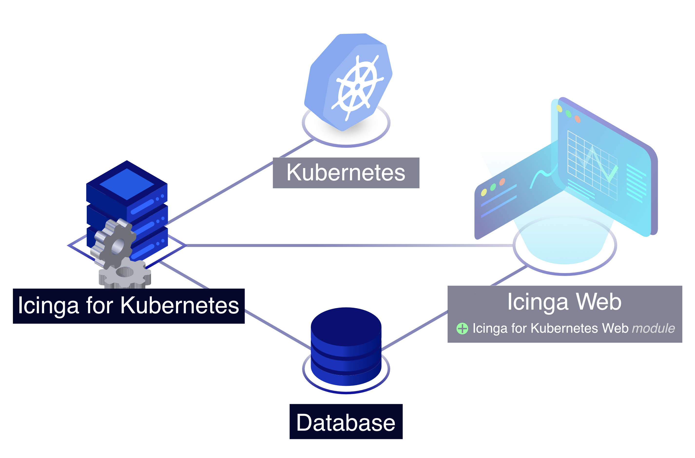

<!--  -->
# Installing Icinga for Kubernetes

The recommended way to install Icinga for Kubernetes is to use prebuilt packages for
all supported platforms from our official release repository.
Please follow the steps listed for your target operating system,
which guide you through setting up the repository and installing Icinga for Kubernetes.

For running Icinga within Kubernetes use our
[Helm charts](https://github.com/Icinga/helm-charts/tree/main/charts/icinga-stack) to
provide a ready-to-use Icinga stack.



<!--  -->
<!--  -->

## Installing the Package

If the [repository](https://packages.icinga.com) is not configured yet, please add it first.
Then use your distribution's package manager to install the `icinga-kubernetes` package
or install [from source](02-Installation.md.d/From-Source.md).
<!--  -->

## Setting up the Database

A MySQL (≥8.0) or MariaDB (≥10.5) database is required to run Icinga for Kubernetes.
Please follow the steps, which guide you through setting up the database and user, and importing the schema.

### Setting up a MySQL or MariaDB Database

Set up a MySQL database for Icinga for Kubernetes:

```
CREATE DATABASE kubernetes;
CREATE USER 'kubernetes'@'localhost' IDENTIFIED BY 'CHANGEME';
GRANT ALL ON kubernetes.* TO 'kubernetes'@'localhost';
```

Icinga for Kubernetes automatically imports the schema on first start and also applies schema migrations if required.
<!--  -->
You can also import the schema file manually, which is located at
`/usr/share/icinga-kubernetes/schema/mysql/schema.sql`.
<!--  -->

<!--  -->
## Configuring Icinga for Kubernetes

Icinga for Kubernetes installs its configuration file to `/etc/icinga-kubernetes/config.yml`,
pre-populating most of the settings for a local setup. Before running Icinga for Kubernetes,
adjust the database credentials and, if necessary, the connection configuration.
The configuration file explains general settings.
All available settings can be found under [Configuration](03-Configuration.md).

## Running Icinga for Kubernetes

The `icinga-kubernetes` package automatically installs the necessary systemd unit files to run Icinga for Kubernetes.
Please run the following command to enable and start its service:

```bash
systemctl enable --now icinga-kubernetes
```
<!--  -->
## Configuring Icinga for Kubernetes

Before running Icinga for Kubernetes, create a local `config.yml` using [the sample configuration](../config.example.yml)
adjust the database credentials and, if necessary, the connection configuration.
The configuration file explains general settings.
All available settings can be found under [Configuration](03-Configuration.md).

## Running Icinga for Kubernetes

With locally accessible
[kubeconfig](https://kubernetes.io/docs/concepts/configuration/organize-cluster-access-kubeconfig/)
and `config.yml` files, `icinga-kubernetes` can be executed by running:

```bash
icinga-kubernetes -config /path/to/config.yml
```

## Using a Container

With locally accessible
[kubeconfig](https://kubernetes.io/docs/concepts/configuration/organize-cluster-access-kubeconfig/)
and `config.yml` files,
run the `icinga/icinga-kubernetes` image using a container runtime of you choice, e.g. Docker:

```bash
export KUBECONFIG=$HOME/.kube/config
export ICINGA_KUBERNETES_CONFIG=config.yml
docker run --rm -v $ICINGA_KUBERNETES_CONFIG:/config.yml -v $KUBECONFIG:/.kube/config icinga/icinga-kubernetes:edge
```

## Running Within Kubernetes

Before running Icinga for Kubernetes inside Kubernetes,
create a local configuration using [the sample configuration](../icinga-kubernetes.example.yml)
adjust the database credentials and, if necessary, the connection configuration.
The sample configuration explains general settings.
All available settings can be found under [Configuration](03-Configuration.md).

You can also use our [Helm charts](https://github.com/Icinga/helm-charts/tree/main/charts/icinga-stack) to
provide a ready-to-use Icinga stack.
<!--  -->

## Installing Icinga for Kubernetes Web

With Icinga for Kubernetes and the database fully set up, you have completed the instructions here and can proceed to
[installing Icinga for Kubernetes Web](https://icinga.com/docs/icinga-kubernetes-web/latest/doc/02-Installation/)
which connects to the database to display and work with the monitoring data.
<!--  --><!-- {# end else if index #} -->
